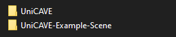

# UniCAVE Example: Operating Room

This is an example scene for the UniCAVE project. This example scene is designed for use with UniCAVE 2019 or newer.

The UniCAVE project is located at <https://github.com/widve/unicave>.

This scene uses UniCAVE as a local Unity package. This repository should be located in the same directory as the main UniCAVE folder, like so:

See the [UniCAVE project wiki](https://github.com/widVE/UniCAVE/wiki/UniCAVE-2019:-Package-Installation) for more information.